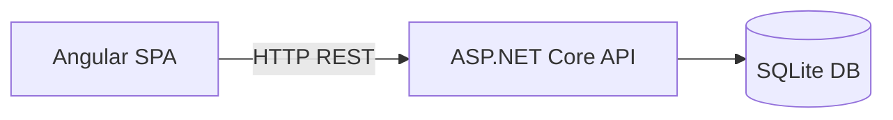
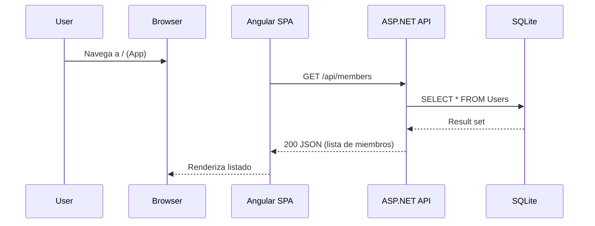
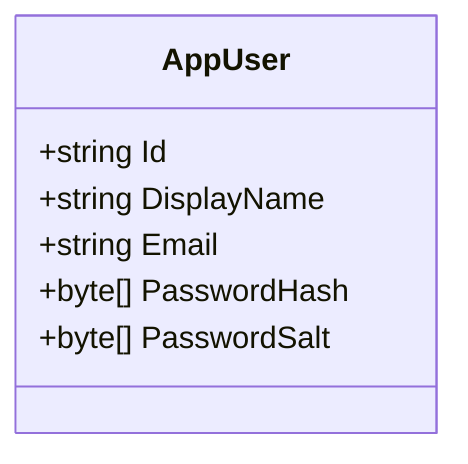

# DatingApp

Aplicación de ejemplo tipo "Dating" compuesta por un backend en **ASP.NET Core (TargetFramework: net10.0)** y un frontend en **Angular 20**. El objetivo es mostrar una arquitectura sencilla: API REST que expone miembros y un cliente SPA que los consume.

> Nota: El `TargetFramework` observado es `net10.0` (versión futura / preview). Asegúrate de tener instalada la versión correspondiente del .NET SDK (preview) o ajusta el `csproj` a una versión estable (por ejemplo `net8.0`) si lo requieres.

## Tabla de contenido
- [DatingApp](#datingapp)
  - [Tabla de contenido](#tabla-de-contenido)
  - [Arquitectura](#arquitectura)
  - [Tecnologías](#tecnologías)
  - [Prerrequisitos](#prerrequisitos)
  - [Instalación Backend](#instalación-backend)
  - [Instalación Frontend](#instalación-frontend)
  - [Migraciones y Base de Datos](#migraciones-y-base-de-datos)
  - [Ejecución en Desarrollo](#ejecución-en-desarrollo)
    - [Ejecución simultánea](#ejecución-simultánea)
  - [Scripts útiles](#scripts-útiles)
  - [Testing](#testing)
  - [Estructura de Carpetas](#estructura-de-carpetas)
  - [Endpoints Principales](#endpoints-principales)
  - [Configuración / Environment](#configuración--environment)
  - [Troubleshooting](#troubleshooting)
  - [Próximos Pasos](#próximos-pasos)
  - [Licencia](#licencia)

## Arquitectura



### Flujo de obtención de miembros


### Modelo de datos principal


## Tecnologías
- **Backend:** ASP.NET Core Web API, Entity Framework Core, SQLite.
- **Frontend:** Angular 20, Tailwind CSS + DaisyUI, RxJS.
- **Herramientas:** pnpm (gestión de paquetes frontend), `dotnet-ef` para migraciones.

## Prerrequisitos
Instala / verifica:

| Herramienta | Versión recomendada | Notas |
|-------------|---------------------|-------|
| .NET SDK    | 10.0                | Necesario para el proyecto API. |
| Node.js     | >= 20               | Algunas dependencias requieren Node 20+. |
| pnpm        | >= 9                | Alternativa más rápida a npm/yarn. |
| SQLite      | (CLI opcional)      | La base de datos se crea automáticamente. |

Instalación rápida (macOS):

```bash
# pnpm (si no lo tienes)
npm install -g pnpm

# dotnet-ef (herramienta global para migraciones)
dotnet tool install --global dotnet-ef
```

## Instalación Backend

```bash
cd API
dotnet restore
```

Si modificaste versiones, compila para validar:
```bash
dotnet build
```

## Instalación Frontend

```bash
cd client
pnpm install
```

Si prefieres npm:
```bash
npm install
```

## Migraciones y Base de Datos
El proyecto usa SQLite (`dating.db`). Para aplicar migraciones existentes:

```bash
cd API
dotnet ef database update
```

Para agregar una nueva migración (ejemplo `AddNewFields`):
```bash
dotnet ef migrations add AddNewFields
dotnet ef database update
```

## Ejecución en Desarrollo

Backend (por defecto en `http://localhost:5000` o puerto dinámico):
```bash
cd API
dotnet run
```

Frontend (Angular dev server en `http://localhost:4200`):
```bash
cd client
pnpm start
# o
ng serve
```

### Ejecución simultánea
Abre dos terminales: uno para API y otro para client. Asegúrate de que el cliente apunta a la URL correcta de la API (puedes manejarlo vía servicios o environment). 

## Scripts útiles

Frontend (`client/package.json`):
| Script | Descripción |
|--------|-------------|
| `pnpm start` | Levanta servidor desarrollo Angular. |
| `pnpm build` | Construye artefactos producción `dist/`. |
| `pnpm test`  | Ejecuta pruebas unitarias Karma/Jasmine. |
| `pnpm ng generate ...` | Scaffolding de componentes, servicios, etc. |

Backend (comandos):
| Comando | Descripción |
|---------|-------------|
| `dotnet run` | Levanta la API. |
| `dotnet build` | Compila el proyecto. |
| `dotnet ef migrations add <Nombre>` | Crea migración EF Core. |
| `dotnet ef database update` | Aplica migraciones. |

## Testing
Frontend:
```bash
cd client
pnpm test
```

Backend (no hay pruebas incluidas aún). Próximo paso sugerido: agregar proyecto de pruebas xUnit o NUnit para servicios y controladores.

## Estructura de Carpetas

```
API/
	Controllers/
	Data/
		Migrations/
	Entities/
client/
	src/
		app/
```

## Endpoints Principales
Ejemplo (según controlador `MembersController`):

```mermaid
graph TD
  GET_M[/GET /api/members] --> RET[Listado AppUser]
  GET_ID[/GET /api/members/{id}] --> RET2[Detalle AppUser]
```

| Método | Endpoint | Descripción |
|--------|----------|-------------|
| GET | `/api/members` | Lista miembros. |
| GET | `/api/members/{id}` | Obtiene detalle. |

Prueba rápida con `curl`:
```bash
curl http://localhost:5000/api/members
```

## Configuración / Environment
Archivos: `appsettings.json` y `appsettings.Development.json`.

Claves típicas a revisar:
- ConnectionStrings
- Logging
- CORS (si lo agregas para permitir al dominio del frontend)

Para variables sensibles usa `dotnet user-secrets` (en desarrollo) o variables de entorno en despliegue.

## Troubleshooting
| Problema | Posible causa | Solución |
|----------|---------------|----------|
| Error SDK .NET | Versión net10.0 no soportada | Cambiar `<TargetFramework>` a `net8.0` o instalar preview SDK. |
| Angular no levanta | Node < 20 | Actualiza Node a >= 20 (`nvm use 20`). |
| Migraciones fallan | Falta `dotnet-ef` | Instala herramienta global (`dotnet tool install --global dotnet-ef`). |
| API no responde al cliente | CORS bloqueado | Configura CORS en `Program.cs`. |

## Próximos Pasos
- Añadir autenticación (JWT / Identity).
- Crear pruebas unitarias backend.
- Añadir documentación Swagger (`Swashbuckle.AspNetCore`).
- Contenedores Docker para API y cliente.
- Pipeline CI (GitHub Actions) para build + tests.

## Licencia
Agregar la licencia que corresponda (MIT / Apache-2.0 / Propietaria). Actualmente no especificada.

---
¿Mejoras sugeridas o dudas? Abre un issue o PR.

